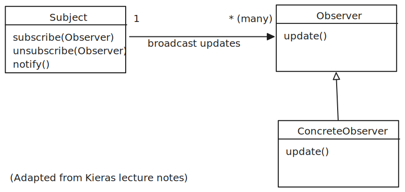
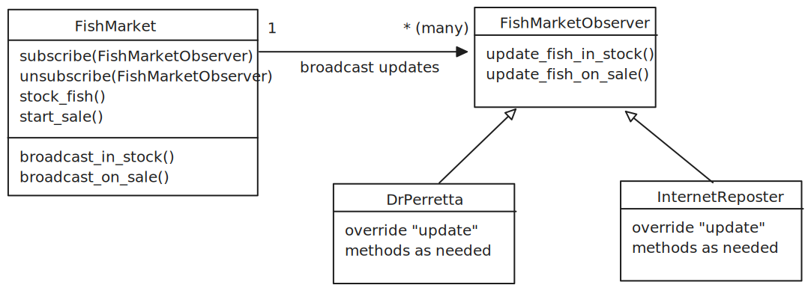
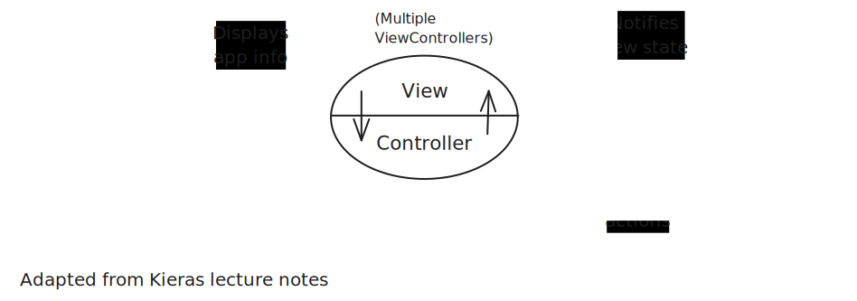
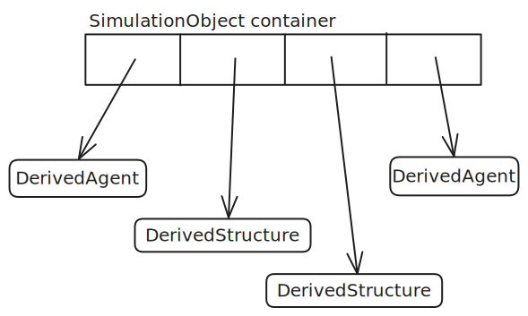
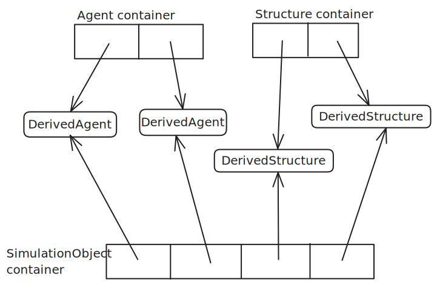

# The Observer Pattern, The Singleton Pattern, and Model-View-Controller

The overarching goal of this lesson is to think critically about **how to structure large software applications.**
Towards this goal, we introduce the Observer and Singleton **design patterns** and apply them in the context of **Model-View-Controller** architecture.
**Model-View-Controller** and its variants are an essential part of virtually every web application and graphical user interface (GUI) application.

**Table of Contents**
1. [The Observer Pattern, The Singleton Pattern, and Model-View-Controller](#the-observer-pattern-the-singleton-pattern-and-model-view-controller)
1. [What are design patterns?](#what-are-design-patterns)
    1. [Recommended Reading](#recommended-reading)
1. [The YAGNI Principle (You Aren't Going to Need It)](#the-yagni-principle-you-arent-going-to-need-it)
1. [The Observer Pattern](#the-observer-pattern)
    1. [Motivating Example: Update a web page when a text input changes.](#motivating-example-update-a-web-page-when-a-text-input-changes)
        1. [A Very Bad Solution](#a-very-bad-solution)
        1. [A Better Solution](#a-better-solution)
    1. [Observer Pattern: Terminology & Overview](#observer-pattern-terminology--overview)
        1. [Detail: Granularity of Updates](#detail-granularity-of-updates)
        1. [Detail: "Push" vs. "Pull"](#detail-push-vs-pull)
    1. [Implementing the "Fish Market" Example](#implementing-the-fish-market-example)
        1. [Full `FishMarket` Implementation](#full-fishmarket-implementation)
    1. [Adding More Observers in the Fish Market Example](#adding-more-observers-in-the-fish-market-example)
        1. [Exercise: Code Comprehension](#exercise-code-comprehension)
        1. [Exercise: What's Wrong with this Design?](#exercise-whats-wrong-with-this-design)
        1. [Exercise Hints](#exercise-hints)
        1. [Exercise: `interface` or `abstract` base class for Observers?](#exercise-interface-or-abstract-base-class-for-observers)
1. [The Singleton Pattern](#the-singleton-pattern)
    1. [Implementing a Singleton in TypeScript](#implementing-a-singleton-in-typescript)
    1. [Interacting with the Singleton Class](#interacting-with-the-singleton-class)
        1. [Do I have to call `getInstance()` every time??](#do-i-have-to-call-getinstance-every-time)
        1. [A further example that is also a rabbit hole](#a-further-example-that-is-also-a-rabbit-hole)
        1. [Rabbit Hole: Dependency Injection](#rabbit-hole-dependency-injection)
1. [Model-View-Controller (MVC)](#model-view-controller-mvc)
    1. [MVC Overview & Responsibilities](#mvc-overview--responsibilities)
        1. [Additional Details: Model](#additional-details-model)
        1. [Additional Details: View](#additional-details-view)
        1. [Additional Details: View & Controller in Graphical User Interface (GUI) Applications](#additional-details-view--controller-in-graphical-user-interface-gui-applications)
1. [The "Separate Containers" Approach to Managing Instances with Different Types](#the-separate-containers-approach-to-managing-instances-with-different-types)

# What are design patterns?

Design patterns provide a way of identifying and describing how to **apply well-known solutions to specific problems.**
Design patterns describe these solutions at a high level, emphasizing how the parts of a system **interact** and what their **roles** are rather than how those parts are implemented.

We've discussed `interface`s as a programming language feature that lets us separate, well, interface from implementation.
We will often use `interface`s when implementing a design pattern, but the pattern itself is describing an even higher level "interface."
In other words, choices like whether to use a `class`, an `interface`, or another language feature are often **implementation details of a design pattern.**

## Recommended Reading

The "Gang of Four" [Design Patterns book](https://en.wikipedia.org/wiki/Design_Patterns) is a pivotal work on this topic.
Note that you will find many, let's say, debates about design patterns on the internet and whether they're "good" or "bad". 
Design patterns are tools to be used **when they match the problem you're trying to solve.**
They are not cure-all solutions to be applied everywhere (cf. "When you have a hammer, everything looks like a nail").
Part of becoming a skilled software engineer is learning to think critically about what is the right tool for the job.

I also recommend looking at the [lecture notes on design patterns from a course I took at University of Michigan](https://websites.umich.edu/~eecs381/lecture/notes.html).
While those notes also cover details specific to C++, they provide a lot of concise, helpful guidance on the design patterns discussed here and many others.

Finally, some [notes and historical documents from one of the creators of MVC](https://folk.universitetetioslo.no/trygver/themes/mvc/mvc-index.html) give some interesting background on the development of Model-View-Controller.

# The YAGNI Principle (You Aren't Going to Need It)

No design is infinitely extensible. 
That is, it's impossible to come up with one design that will let you address all possible future requirements without ever changing the design.
As it turns out, trying to over-plan and over-design for potential future requirements can result in systems that are harder to understand and harder to maintain.

The Observer Pattern and Model-View-Controller are tried-and-true strategies for making specific kinds of applications more extensible, but remember that we only reap the benefits if the needs of our application match the pattern.
The HW6 specification aims to guide you towards a design that allows for extensibility in certain areas (namely, adding new kinds of simulation objects and new kinds of views) but that does not try to over-abstract for changes we might or might not make.
We want to strike a balance between having a system that is easy to understand and maintain in its current form and that is easy to extend.

# The Observer Pattern
The Observer Pattern is ubiquitous in today's world. 
Every time you receive a notification on your phone or wait for your order number to be called at a deli, you are seeing this pattern in action.

In this section, we show how this pattern works in software.

## Motivating Example: Update a web page when a text input changes.
Consider the following scenario: We want to construct a simple web page that has a text input. Whenever that text input changes, we want to display that same text somewhere else on the page.

### A Very Bad Solution
First, let's look at a very bad solution.
Paste this code into a file called `input_demo.html`, and open that file with your web browser.
Enter some text in the input field that displays on the page.
What problems do you see with how the page updates when you type?
```html
<!DOCTYPE html>
<html lang="en">
  <head>
    <meta charset="UTF-8" />
    <meta name="viewport" content="width=device-width, initial-scale=1.0" />
    <title>Document</title>
  </head>
  <body>
    <div>
      <input id="name-input" />
    </div>
    <div>Hello, <span id="name-display"></span>!</div>

    <script>
      // setInterval calls the function passed to it every N milliseconds.
      // Here, we read the input value and display it on the page
      // every second.
      // Why is this bad?
      setInterval(() => {
        console.log('Checking');
        // Read the value from the input
        const value = document.getElementById('name-input').value;

        // Set the text of our "name-display" element.
        document.getElementById('name-display').replaceChildren(document.createTextNode(value));
      }, 1000);
    </script>
  </body>
</html>
```

What are the problems with this solution? 
1. Since it only checks once per second, there is a delay between when the user types and when the greeting message updates.
2. If we instead check every, say, 1 millisecond, we have introduced **egregious inefficiency**. That is, inefficiency that has no benefits to offset the cost. We might be able to get away with it for this small program. However, if we were doing something more expensive such as sending requests over the internet, that could quickly cause problems.

### A Better Solution
Conveniently, HTML input elements provide a way for us to register a **callback function** that gets called every time the input actually changes (specifically, we ask it to be called every time a key is released on the keyboard).
In your file `input_demo.html`, replace the javascript code inside the `<script> ... </script>` tag with the following:
```javascript
// Register a function to be called automatically whenever the user types in the input.
document.getElementById('name-input').addEventListener('keyup', (event) => {
  // Read the value from the input
  const value = document.getElementById('name-input').value;

  // Set the text of our "name-display" element.
  document.getElementById('name-display').replaceChildren(document.createTextNode(value));
});
```

## Observer Pattern: Terminology & Overview
There are two roles in the Observer Pattern.
* The **Subject** (a.k.a. **Publisher**) is the source of new/updated information.
* The **Observer** (a.k.a. **Subscriber**) receives information from the Subject.



These roles interact as follows:
* Observers can **subscribe** to the Subject. Subscribing tells the Subject that the Observer wants to receive updates.
  * Observers can also Unsubscribe when they no longer need updates.
* When the Subject has new/updated information, it **notifies** its Subscribers (a.k.a., **broadcasts**) by calling an **update** on every Subscriber.
  * When receiving an update, Subscribers can choose to do something with that information or to ignore it.
  * Note: Depending on the needs of our application, the Subject can choose to make its "notify" methods (that call "update" on every subscribers) public or private. You will have to make such a choice on HW6.

For example, Dr. Perretta likes to know when his favorite fish market has seasonal catches in stock or on sale.
Not wanting to miss certain things, he **subscribed** to the market's email newsletter.
The fish market **broadcasts** information to its subscribers every week by sending an email.
If the update says that it's peak swordfish season, Dr. Perretta is more likely to go buy swordfish (and, if it's warm outside, make *panini pescispada*, a staple of Scilla).
If the update is about corn chowder or salmon burgers (nothing personal against those), he will probably **ignore** the update.

Computationally, it might seem inefficient to send out updates that are ignored. 
However, there are several benefits to this that outweigh the cost in the situations when this pattern is used:
1. The Subject is **decoupled** from the Observers. 
   That means the **Subject doesn't need to know** or keep track of any **implementation details of the Observers**.
   In our example, the fish market doesn't need to know what Dr. Perretta's preferences are. 
2. The Observers don't need to repeatedly check whether the Subject has any new data.
   Dr. Perretta doesn't need to call the fish market every day to see what they have in stock.

### Detail: Granularity of Updates
In our fish market example, subscribed customers receive every update.
In a different scenario, the Observers might be able to subscribe to only the specific kinds of updates they care about.
In our [HTML input exampe](#a-better-solution), we only subscribed to `keyup` events.
There are other kinds of events that the input element broadcasts, but our function will not receive them.

### Detail: "Push" vs. "Pull"
In our fish market example, the update emails sent to customers include all of the details about what's new (e.g., which seasonal fish is in stock).
We refer to this strategy as "push" because all the information is "pushed" to the customer, and the customer decides what to act on and ignores the rest.

If this were implemented using a "pull" strategy, the emails sent to customers would include less information.
For example, it might just say "new fish in stock," and the customer would then decide whether to call and ask for more details.

This strategy doesn't seem very good for our fish market, but it can be useful in certain software application contexts.
For our purposes, we'll focus on the "push" strategy.

## Implementing the "Fish Market" Example
To implement a small version of our fish market example, we need to use the features of our programming language to specify how our Subject and Observers should communicate.

Let's build up our implementation one piece at a time.

First, we need a class representing our fish market that encapsulates its data and functionality.
For now, we'll just have two methods: One to add a fish to the store's inventory and one to mark a fish as being on sale.

```typescript
class FishMarket  {
  private _inventory = new Set<string>();
  private _on_sale: string | null = null;

  stock_fish(fish: string) {
    this._inventory.add(fish);
    this.broadcast_in_stock(fish);
  }
  start_sale(fish: string) {
    this._on_sale = fish;
    this.broadcast_on_sale(fish);
  }
}
```

Next, we need a way for interested customers to subscribe for updates and to unsubscribe if they wish.
The question here becomes, what should be the type of the paramater that the `subscribe` and `unsubscribe` methods expect?

```typescript
class FishMarket  {
  subscribe(subscriber: ???) { }

  unsubscribe(subscriber: ???) { }

  // other members omitted for brevity
}
```

Since we have two fish market state changes that customers might be interested in (new fish in stock & a fish goes on sale), we need subscribers to expose methods that the fish market can call and pass the update information to.
To accomplish this, we'll define an `interface` called `FishMarketObserver` and update the `subscribe` and `unsubscribe` methods to expect a parameter of this type.

```typescript
interface FishMarketObserver {
  update_fish_in_stock(fish: string): void;
  update_fish_on_sale(fish: string): void;
}

class FishMarket  {
  subscribe(subscriber: FishMarketObserver { }

  unsubscribe(subscriber: FishMarketObserver { }

  // other members omitted for brevity
}
```

Next, we need to update the `FishMarket` class so that it keeps track of its subscribers.
We can use a `Set` for this so that we can efficiently add and remove subscribers as needed.

```typescript
class FishMarket  {
  private _subscribers = new Set<FishMarketObserver>();

  subscribe(subscriber: FishMarketObserver { 
    this._subscribers.add(subscriber);
  }

  unsubscribe(subscriber: FishMarketObserver { 
    this._subscribers.delete(subscriber);
  }

  // other members omitted for brevity
}
```

### Full `FishMarket` Implementation



Now that the `FishMarket` keeps track of its subscribers, it can **broadcast** updates when the market's state changes.
In the updated code below:
- `stock_fish` calls `broadcast_in_stock`, which calls `update_fish_in_stock` on every subscriber
- `start_sale` calls `broadcast_on_sale`, which calls `update_fish_on_sale` on every subscriber

```typescript
interface FishMarketObserver {
  update_fish_in_stock(fish: string): void;
  update_fish_on_sale(fish: string): void;
}

class FishMarket  {
  private _subscribers = new Set<FishMarketObserver>();

  private _inventory = new Set<string>();
  private _on_sale: string | null = null;

  subscribe(subscriber: FishMarketObserver) {
    this._subscribers.add(subscriber);
  }

  unsubscribe(subscriber: FishMarketObserver) {
    this._subscribers.delete(subscriber);
  }

  stock_fish(fish: string) {
    this._inventory.add(fish);
    this.broadcast_in_stock(fish);
  }

  private broadcast_in_stock(fish: string) {
    for (const subscriber of this._subscribers) {
      subscriber.update_fish_in_stock(fish);
    }
  }

  start_sale(fish: string) {
    this._on_sale = fish;
    this.broadcast_on_sale(fish);
  }

  private broadcast_on_sale(fish: string) {
    for (const subscriber of this._subscribers) {
      subscriber.update_fish_on_sale(fish);
    }
  }
}
```

This is all of the infrastructure that we need.
In the next section, we add some concrete observer classes and discuss the benefits of applying the Observer Pattern.

## Adding More Observers in the Fish Market Example

Notice that:
- We've **fully implemented** our fish market
- We have **not yet defined any classes whose instances will subscribe to the fish market**

How is this so? Because the Subject (`FishMarket`) is **decoupled** from its observers.
The Subject **only has to know** that the observers will be able to **receive its updates,** and it ensures this using the `FishMarketObserver` interface.
This makes our system **extensible.**
We can easily add new observers that receive the "in stock" and "on sale" updates from the `FishMarket` **without making any changes to the fish market.**

Let's capitalize on this extensibility and add a few right now.

```typescript
class InternetReposter implements FishMarketObserver {
  update_fish_on_sale(fish: string): void {
    console.log(`${fish} is on sale!`)
  }

  update_fish_in_stock(fish: string): void {
    console.log(`${fish} is in stock!`)        
  }
}

class DrPerretta implements FishMarketObserver {
  update_fish_on_sale(fish: string): void {
    if (fish === 'swordfish') {
      console.log('pescespada!!!')
    }
  }

  update_fish_in_stock(fish: string): void {
    if (fish === 'bluefish') {
      console.log('I do like bluefish');
    }
  }
}
```

### Exercise: Code Comprehension
Given the [fish market](#full-fishmarket-implementation) implementation and the [observer class implementations](#adding-more-observers-in-the-fish-market-example) from before, what is the output of the code below?
Trace through the code on paper, keeping track of the list of subscribers as you go.

```typescript
const market = new FishMarket();
market.stock_fish('one fish');

const internet_reposter1 = new InternetReposter();
market.subscribe(internet_reposter1);

const internet_reposter2 = new InternetReposter();
market.subscribe(internet_reposter2);

market.stock_fish('two fish');

const dr_perretta = new DrPerretta();
market.subscribe(dr_perretta);

market.unsubscribe(internet_reposter1);

market.stock_fish('swordfish');
market.start_sale('swordfish');
market.stock_fish('bluefish');
```

### Exercise: What's Wrong with this Design?

Suppose we had designed & implemented our fish market as shown below instead of using the observer pattern.
It doesn't have the ["busy waiting" problem from our motivating example](#motivating-example-update-a-web-page-when-a-text-input-changes), but it does have other problems.
What is wrong with this design?

```typescript
class InternetReposter2 {
  post_fish_on_sale(fish: string) {
    // omitted for brevity
   }
}

class DrPerretta2 {
  buy_swordfish() {
    // omitted for brevity
  }
}

class FishMarket  {
  constructor(
    private dr_perretta: DrPerretta2,
    private internet_reposters: InternetReposter2[],
  ) {}

  stock_fish(fish: string) {
    if (fish === "swordfish") {
      this.dr_perretta.buy_swordfish();
    }
  }

  start_sale(fish: string) {
    for (const reposter of this.internet_reposters) {
      reposter.post_fish_on_sale(fish);
    }
  }
}
```

#### Exercise Hints
1. What benefits does the Observer Pattern give us? Which of those benefits does this design lose?
1. How would we have to modify the `FishMarket` code if we needed to add three additional types of subscribers?

### Exercise: `interface` or `abstract` base class for Observers?
In TypeScript (and other languages that have these inheritance options), we could define our Observer interface using an `interface` or an abstract base class.
When might we prefer one over the other?
Answer the question in with respect to the following:
- Single inheritance vs. multiple inheritance
- Abstract vs. non-abstract methods in the base class or interface

# The Singleton Pattern

The Singleton Pattern can be applied when an application has state that needs to be globally accessible/updatable in a controlled way.

Up to this point, you've probably been told something like, "Global variables are turbo trash garbage, never use them ever ever ever they are bad and will make you sad."

This is still true.

At the same time, global **state** is very common in larger-scale applications.
What we mean here is that the application has some central/core "business logic", and the data and functionality that are part of that business logic need to be accessible without having to pass all of the data as a parameter to every single class and function in the system.

Additionally, it often only makes sense for there to be **one** instance of that central business logic.
As an analogy, if your application has a database, you probably only want one copy of that database (from the application's perspective--database replication is more of an implementation detail).

The Singleton Pattern describes a way that we can accomplish these goals:
1. Guarantee that there is only **one instance** of a class
1. Make that one instance **globally accessible**
1. Provide **controlled access** to the state that the class manages

## Implementing a Singleton in TypeScript

First, we define the class that manages our application state.

```typescript
class MyAppData {
  // Thing class omitted for brevity
  private someThings: Thing[] = [];

  addThing(id: string, numSpams: number) { ... }
  findThing(id: string) { ... }
  duplicateThing(id: string) { ... }
}
```

Then, we make the **constructor private.** 
This prevents code outside the singleton class from creating instances of it.

```typescript
class MyAppData {
  private someThings: Thing[] = [];

  // The constructor likely won't take in any parameters.
  // All the state modification is handled through methods.
  private constructor() { 
    // Any initialization, if needed
  }

  addThing(id: string, numSpams: number) { ... }
  findThing(id: string) { ... }
  duplicateThing(id: string) { ... }
}
```

Next, we need a place to store the one instance of the singleton class.
We'll store that instance in a **static attribute** on the class.

```typescript
class MyAppData {
  private someThings: Thing[] = [];

  // Initialize to null for now. The instance
  // is created in the next step.
  private static instance MyAppData | null = null;

  // The constructor likely won't take in any parameters.
  // All the state modification is handled through methods.
  private constructor() { 
    // Any initialization, if needed
  }

  addThing(id: string, numSpams: number) { ... }
  findThing(id: string) { ... }
  duplicateThing(id: string) { ... }
}
```

Finally, we add a **static `getInstance`** method that provides access to the instance of the singleton and creates the instance if one doesn't already exist.

```typescript
class MyAppData {
  private someThings: Thing[] = [];

  static getInstance(): MyAppData {
    if (MyAppData.instance === null) {
      MyAppData.instance = new MyAppData();
    }
    return MyAppData.instance;
  }

  // Initialize to null for now. The instance
  // is created in the next step.
  private static instance MyAppData | null = null;

  // The constructor likely won't take in any parameters.
  // All the state modification is handled through methods.
  private constructor() { 
    // Any initialization, if needed
  }

  addThing(id: string, numSpams: number) { ... }
  findThing(id: string) { ... }
  duplicateThing(id: string) { ... }
}
```

## Interacting with the Singleton Class

Now any part of our application can interact with the central application data/logic in a controlled way.

```typescript
MyAppData.getInstance().addThing("walugi", 42);
MyAppData.getInstance().addThing("sanic", 43);
console.log(MyAppData.getInstance().findThing("sanic"));
MyAppData.getInstance().duplicateThing("waluigi");
```

### Do I have to call `getInstance()` every time??

Yes.

It may be tempting to store the instance in a local variable instead
```typescript
// DON'T DO THIS
const data = MyAppData.getInstance();
data.duplicateThing("waluigi");
```

Why?

The `getInstance()` method is responsible for guaranteeing that an instance of the singleton class is available and providing a reference to that instance **when called.**
The details of how that instance is managed are **implementation details** that code using the singleton **should not depend on.**

#### A further example that is also a rabbit hole
To give a concrete example, it has become fairly common for modern web applications to use a library such as Flux, Redux, or one of many other variants to manage global state.
These libraries essentially apply the Singleton pattern and add various features.
One of those features is storing the history of the application's state.
One way to implement this feature is as follows: Anytime the Singleton's state would change, make a copy of the instance, update the copy, set the copy as the current instance, and add the previous version to a stack.
But wait! Isn't a Singleton supposed to have only one instance?
Yes, from the perspective of **code interacting with the Singleton.**

##### Rabbit Hole: Dependency Injection
Another strategy that can be used for making global state available is "dependency injection."
Think of it like this: Instead of parts of our application, say, a function or class, accessing our Singleton class through the `getInstance` method, the function/class would instead declare (either as a parameter or using some other mechanism) that it depends on the Singleton.
Then, a dependency injection framework would find those dependency declarations and provide the Singleton instance when needed.

The static `getInstance()` approach we take to implementing our singleton is relatively uncommon in modern applications, but it is also simpler to implement than a full dependency injection system, so it suits our purposes for this class well enough.

# Model-View-Controller (MVC)

Model-View-Controller is the backbone of graphical user interface (GUI) systems.
Practically every UI framework, web framework, and game engine follows some version of this pattern, sometimes with modifications to better suit the domain of those kinds of applications.

In this section, we start with a high-level overview of the pattern and then discuss further details of each structural component.

## MVC Overview & Responsibilities


The **Model** encapsulates the core data and logic of an application.
It provides controlled access to the data and functions of our application and is where any changes to the state of the application are applied.
There is typically only one Model.

The **View** is responsible for communicating information about the state of the application to the user. 
There are usually multiple Views that inherit from a common base class.
Different combinations of Views can be open at a given time.
The View receives updates from the Model via a Subject (Model) to Observer (View) relationship.
Importantly, **the View does NOT apply user commands to the Model.**
That is the Controller's job.

The **Controller** accepts commands from the user and applies those commands by calling the appropriate methods exposed by the Model.
The Controller is also responsible for opening/closing views and subscribing/unsubscribing them to/from the Model.
In contrast to the Model, which is decoupled from (i.e., doesn't know the details of) the derived View classes, the Controller does know about the derived View classes. 
This is necessary so that the controller can open/close the right kind of view when the user requests it.

### Additional Details: Model
For our purposes in this class, our Model will follow the [Singleton Pattern](#the-singleton-pattern).

### Additional Details: View
Depending on the type of application, the View may request data directly from the Model (see ["push" vs. "pull"](#detail-push-vs-pull) in the Observer pattern).
Both approaches are common in modern web applications; however, this is somewhat beyond the scope of this course.

### Additional Details: View & Controller in Graphical User Interface (GUI) Applications

In our MVC architecture diagram, the Controller and View are separate entities.
This relationship applies moreso to terminal-based applications where the user types commands into a command prompt and sees the results printed to the screen.
The Controller directly processes the input passed to the command prompt and requests that the proper Views print themselves to the screen.

In Graphical User Interface (GUI) applications, the View and the Controller are more tightly linked.
Instead of using a text-based command prompt, the user issues commands by interacting with visual elements of the current Views, e.g., clicking a button or entering some text in a form input element.
When applying MVC to these kinds of applications, our design diagram would likely couple the View and Controller into a ViewController.
We can still have multiple Views, but each View now has its own Controller coupled to it.



Importantly, the responsibilities of the View and Controller **have not changed.**
The Controller part of the ViewController is still responsible for applying user actions to the Model, and the View still receives updates from the Model and displays the state of the application to the user.
The Model is still decoupled from the Views (and the Controller, for that matter).

# The "Separate Containers" Approach to Managing Instances with Different Types

In Homework 6, you will implement an extensible graphical simulation by applying the MVC pattern.
Objects in the simulation share a common `SimulationObject` base class, but certain types of simulation objects have different capabilities.
`Agent`s start at a location and can move around, and `Structure`s start at a location but do not move.

The Model is responsible for managing simulation objects.
If we only stored all of our `Agent`s and `Structure`s in a container of `SimulationObjects`, we would not be able to look up an `Agent` and direct it to start moving without resorting to "switch-on-type" and breaking our abstraction. 



Instead, we can use a strategy called "separate containers."
In addition to our container of all simulation objects, we can add two more containers: one with only agents, and one with only structures.
Then, instead of a general `addSimulationObject` method for adding a simulation object to the model, we can add an `addAgent` method and an `addStructure` method that adds the new object to the appropriate containers.
Then, when we need to look up a specific agent or structure by its ID, we can search the appropriate container.



**Consider for HW6**: What kind of data structure should we store the objects in? 
Consider what operations the Model needs to perform and what the runtime complexity would be for those operations with different container choices.

**Consider for HW6**: What are the tradeoffs of keeping all three containers (one for all simulation objects, one for agents, and one for structures) vs. only having the latter two containers?
